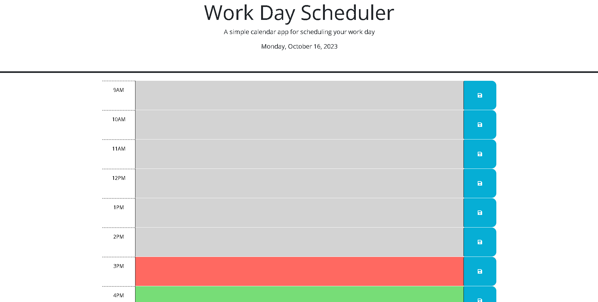

# My Calendar

## Description

This week's challenge is about creating a work calendar that allows the user to save events for each hour of a typical working day (9am - 5pm). This app runs in the browser and features dynamically updated HTML and CSS powered by jQuery.

The Work Calendar has a lot of functionality thanks to the jQuery library and JavaScript methods such as: DayJS, Click Events, Form Elements, Dom Traversal, Event Delegation, Widgets and Interactions. With these new knowledge we were able to create a more functional and interactive app. In this challenge we learn how to use DayJs to get data such as current dates and hours, delegate events, add classes if they meet a condition and save and get information to the local storage, all of this by manipulating the DOM with jQuery. 

## Installation

N/A

## Usage

This app runs in the browser, so when the user uploads the app, then sees a work calendar with current Date display, as well as a section divided by hours from 9am - 5pm distributed in rows. The color of the rows depends on the current hour, the color grey represents the past hours, the red is the current hour and the green color is the future hours. This makes the app more visual, so that the user quickly distinguish what events have already occur or not. 

Each row has a text input, so that the user can register the events for the next day and click on the save button that is on the right. Since we are using local storage, the information that the user write, once he/she clicks on the save button, then the information is saved. 

Link to Github Pages --> https://thelmarivas.github.io/mycalendar/

## Credits

This week's challenge was accomplished with the help of bootcamp TA's, MDN documentation and Class content such as Gitlab works and Zoom recordings. 

## License

MIT License